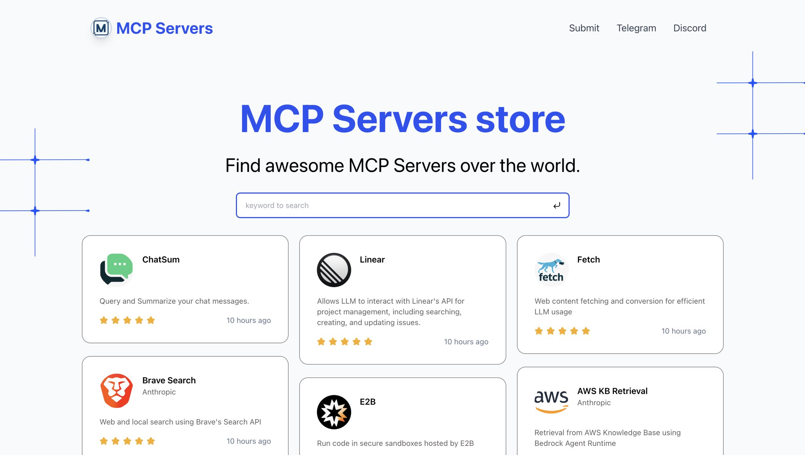

# MCP Directory

A directory for Awesome MCP Servers — discover, search, and explore Model Context Protocol (MCP) servers for Claude and other AI applications.

**Live preview:** [https://mcp.so](https://mcp.so)



## Features

- **Browse** featured MCP servers with search and keyword filtering
- **Categories** — explore servers by category
- **Project details** — full README content with markdown rendering
- **Submit** — add new MCP servers via API or GitHub issue
- **AI summarization** — OpenAI-powered extraction of project metadata from README files
- **SEO** — sitemaps, robots.txt, and canonical URLs

## Tech Stack

| Layer | Technologies |
|-------|--------------|
| Framework | Next.js 15, React 19 |
| Styling | Tailwind CSS, Framer Motion |
| Database | Supabase (PostgreSQL) |
| AI | OpenAI (summarization), Jina AI (URL content extraction) |
| Deployment | Cloudflare Pages, Vercel |

## Project Structure

```
├── app/                    # Next.js App Router
│   ├── (default)/         # Main routes: home, categories, project detail
│   ├── (policy)/          # Privacy policy, Terms of service
│   └── api/               # API routes
├── templates/tailspark/   # UI templates & components
├── models/                # Supabase data access (project, category, user)
├── services/              # Business logic (project parsing, LLM, readers)
├── types/                 # TypeScript definitions
├── pagejson/              # Static content & metadata
└── data/                  # SQL schema (install.sql)
```

## Prerequisites

- [Node.js](https://nodejs.org/) (v20+)
- [pnpm](https://pnpm.io/)
- [Supabase](https://supabase.com/) account

## Quick Start

### 1. Clone the repository

```bash
git clone https://github.com/chatmcp/mcp-directory.git
cd mcp-directory
```

### 2. Install dependencies

```bash
pnpm install
```

### 3. Set up the database

Create a project on [Supabase](https://supabase.com/) and run the schema:

```sql
-- Execute data/install.sql in the Supabase SQL editor
```

### 4. Configure environment variables

Create a `.env` file in the project root:

```env
# Required — Supabase
SUPABASE_URL="your-supabase-project-url"
SUPABASE_ANON_KEY="your-supabase-anon-key"

# Required — App URL
NEXT_PUBLIC_WEB_URL="http://localhost:3000"

# Optional — AI summarization (for /api/summarize-project)
OPENAI_API_KEY="your-openai-api-key"
OPENAI_BASE_URL="https://api.openai.com/v1"  # or custom endpoint
OPENAI_MODEL="gpt-4o-mini"                   # model for extraction/summarization
```

### 5. Run the development server

```bash
pnpm dev
```

Open [http://localhost:3000](http://localhost:3000) in your browser.

## Scripts

| Command | Description |
|---------|-------------|
| `pnpm dev` | Start Next.js dev server |
| `pnpm watch` | Start with Turbopack |
| `pnpm build` | Production build |
| `pnpm start` | Start production server |
| `pnpm lint` | Run ESLint |
| `pnpm pages:build` | Build for Cloudflare Pages |
| `pnpm preview` | Build + run Cloudflare Pages locally |
| `pnpm deploy` | Build + deploy to Cloudflare Pages |

## Deployment

### Cloudflare Pages

1. Add `wrangler.toml` and configure the project (see [Cloudflare Next.js docs](https://developers.cloudflare.com/pages/framework-guides/nextjs/)).
2. Build and deploy:

```bash
pnpm deploy
```

### Vercel

```bash
vercel
```

## API

| Endpoint | Method | Description |
|----------|--------|-------------|
| `/api/submit-project` | POST | Submit a new MCP project (JSON body) |
| `/api/submit-projects` | POST | Submit multiple projects |
| `/api/summarize-project` | POST | Trigger AI summarization for a project (requires `{ "name": "project-name" }`) |
| `/api/summarize-projects` | POST | Batch summarization |

## Community

- [MCP Server Telegram](https://t.me/+N0gv4O9SXio2YWU1)
- [MCP Server Discord](https://discord.gg/RsYPRrnyqg)
- [ChatMCP Official Twitter](https://x.com/chatmcp)

## About the author

- [idoubi](https://bento.me/idoubi)
- [Follow me on Twitter](https://x.com/idoubicv)
- [Buy me a coffee](https://www.buymeacoffee.com/idoubi)
